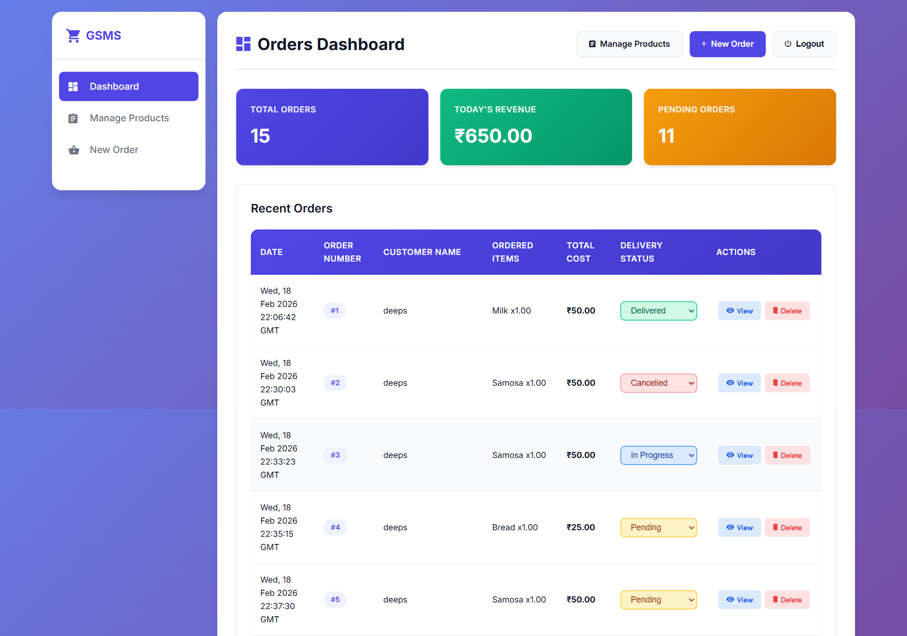
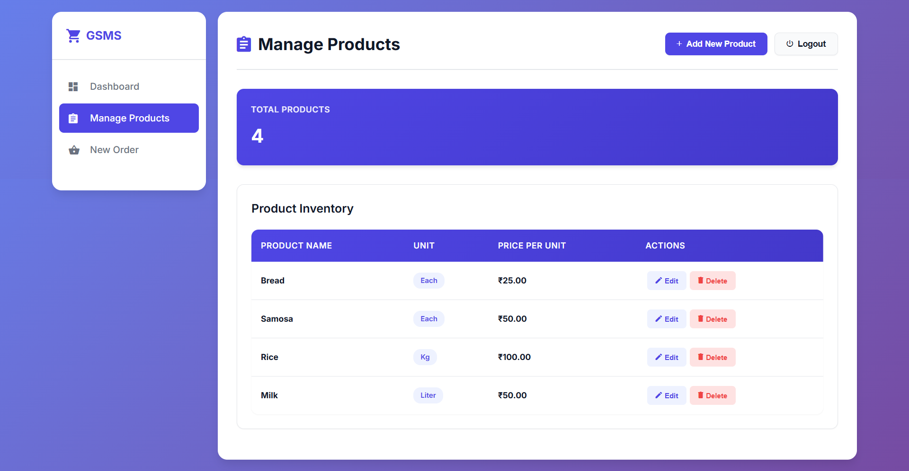
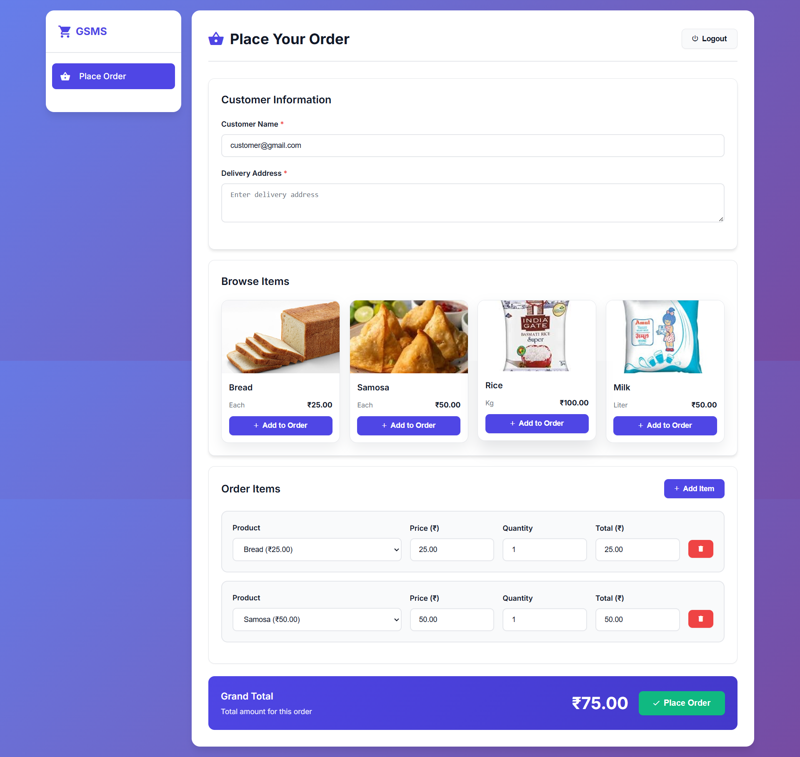
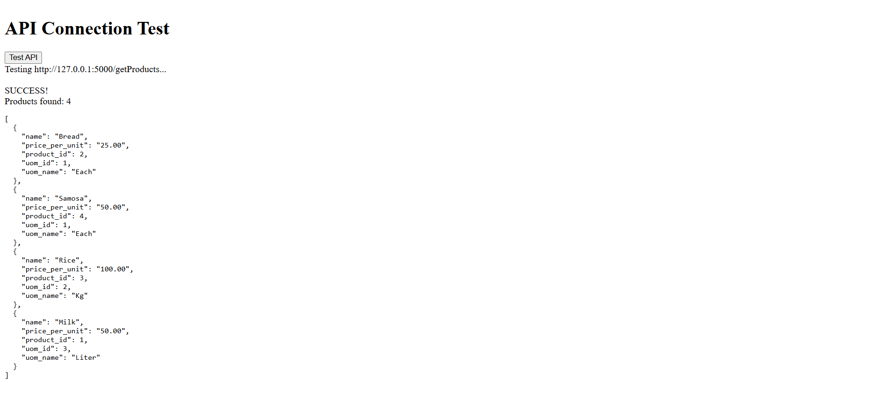

# Grocery Store Management System (GSMS)

A full-stack grocery store management app with an admin dashboard, customer ordering flow, and MySQL backend.

## Features

- Admin dashboard with orders, status updates, and order details
- Product management (add, edit, delete)
- Customer login with dedicated ordering page
- Delivery address captured and shown in admin view
- Local product images for customer item cards
- Role-based routing (admin vs customer)

## Frontend Screenshots






## Tech Stack

- Frontend: HTML, CSS, JavaScript, jQuery
- Backend: Python (Flask)
- Database: MySQL

## Project Structure

- backend/ - Flask server, DAO files, database scripts
- ui/ - HTML, CSS, JS
- ui/images/products/ - Local product images

## Setup

### 1) Create and activate a virtual environment

```
python -m venv .venv
.venv\Scripts\activate
```

### 2) Install Python dependencies

```
pip install flask flask-cors mysql-connector-python werkzeug
```

### 3) Configure MySQL

Ensure MySQL is running and update credentials in backend/sql_connection.py if needed.

### 4) Initialize database columns and users

```
.venv\Scripts\python.exe backend\add_users_table.py
.venv\Scripts\python.exe backend\add_delivery_address.py
```

### 5) Start the backend server

```
.venv\Scripts\python.exe backend\server.py
```

### 6) Serve the UI

Use VS Code Live Server or any static server from the ui/ folder.

## Default Accounts

- Admin: admin@gmail.com / Admin@123
- Customer: customer@gmail.com / Customer@123

## Local Product Images

Place images in:

```
ui/images/products/
```

Naming convention (lowercase slug of product name):

- Bread -> bread.jpg
- Milk -> milk.jpg
- Rice -> rice.jpg
- Samosa -> samosa.jpg

Recommended size: 320x200 or 640x400 (16:10 ratio)

## Key URLs

- Admin login: ui/admin-login.html
- Customer login: ui/customer-login.html
- Admin dashboard: ui/index.html
- Customer order page: ui/customer-order.html

## Notes

- If the admin dashboard shows no data, verify the backend server is running and refresh the page.
- If product images do not load, check file names and the images path.

## Scripts

- backend/add_users_table.py - creates users table and seeds default accounts
- backend/add_delivery_address.py - adds delivery address column to orders

## Troubleshooting

- 404 on API endpoints: backend not running or wrong port
- CORS issues: confirm Flask server is running on port 5000
- Login fails: re-run add_users_table.py and restart the backend
